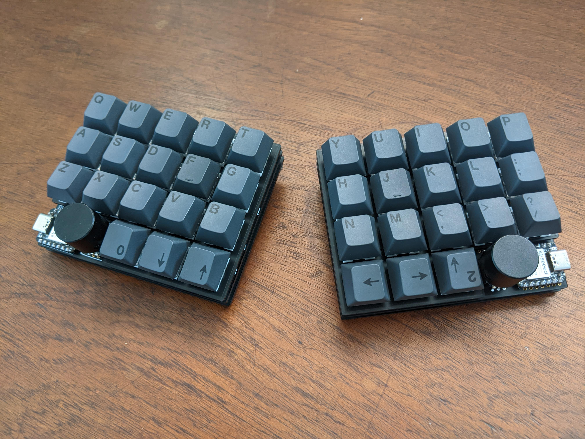
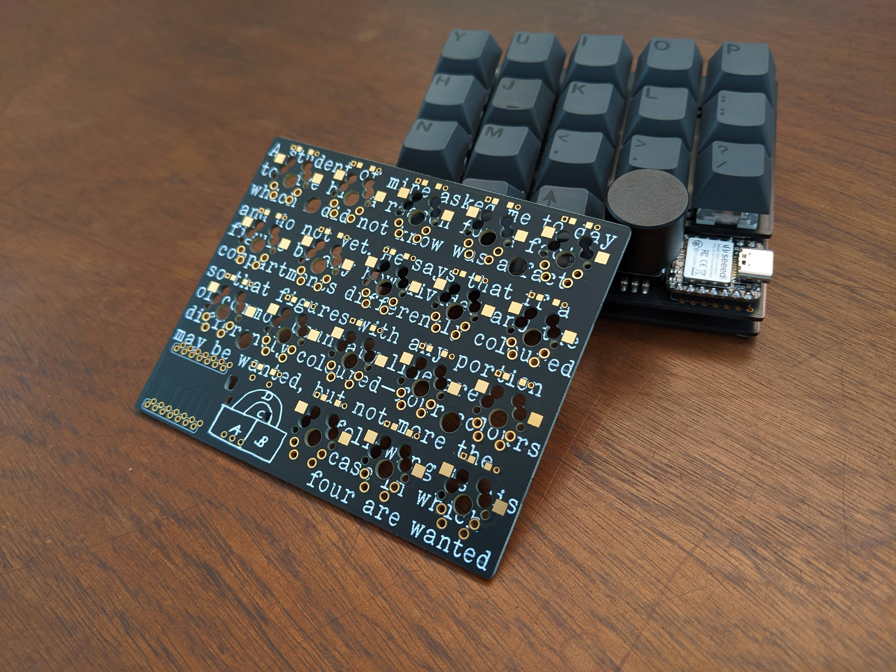
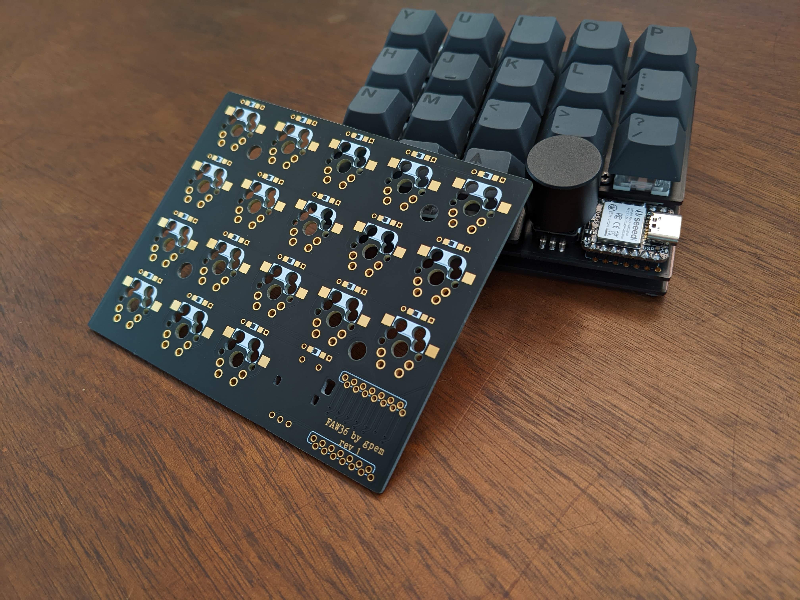
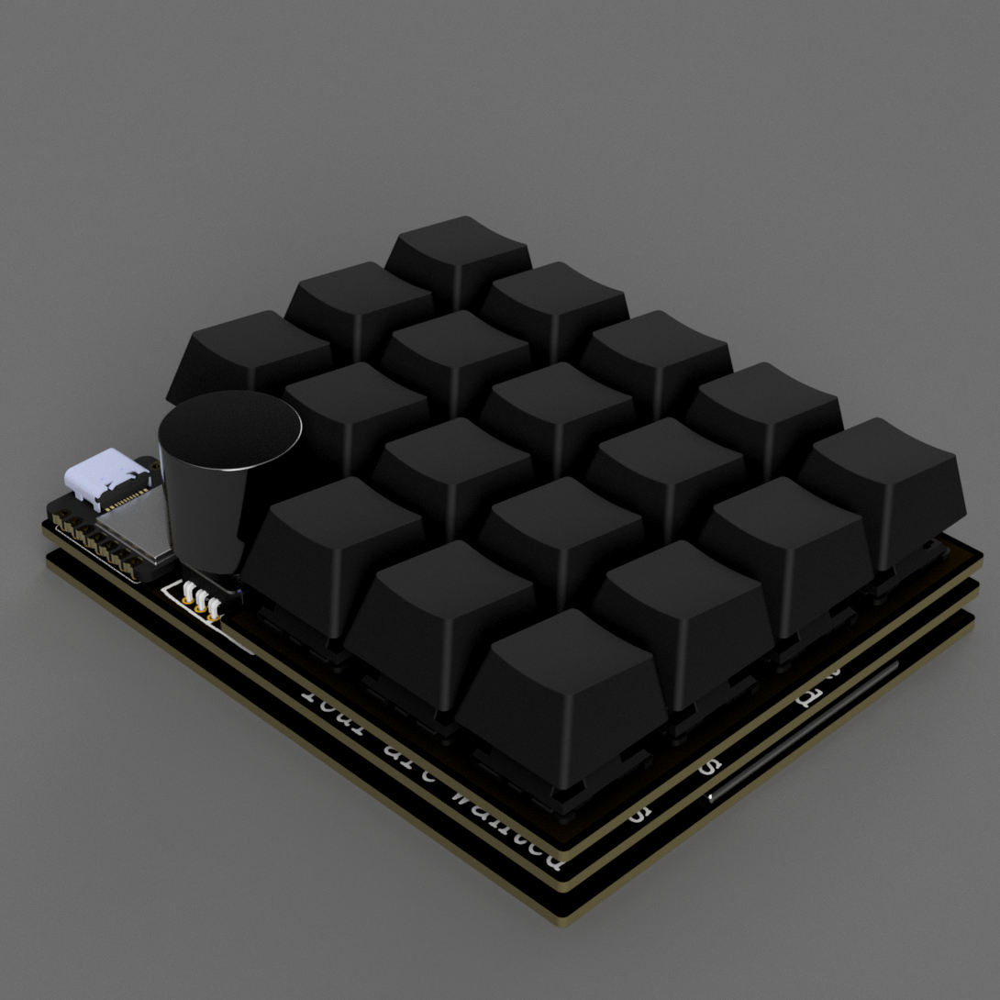
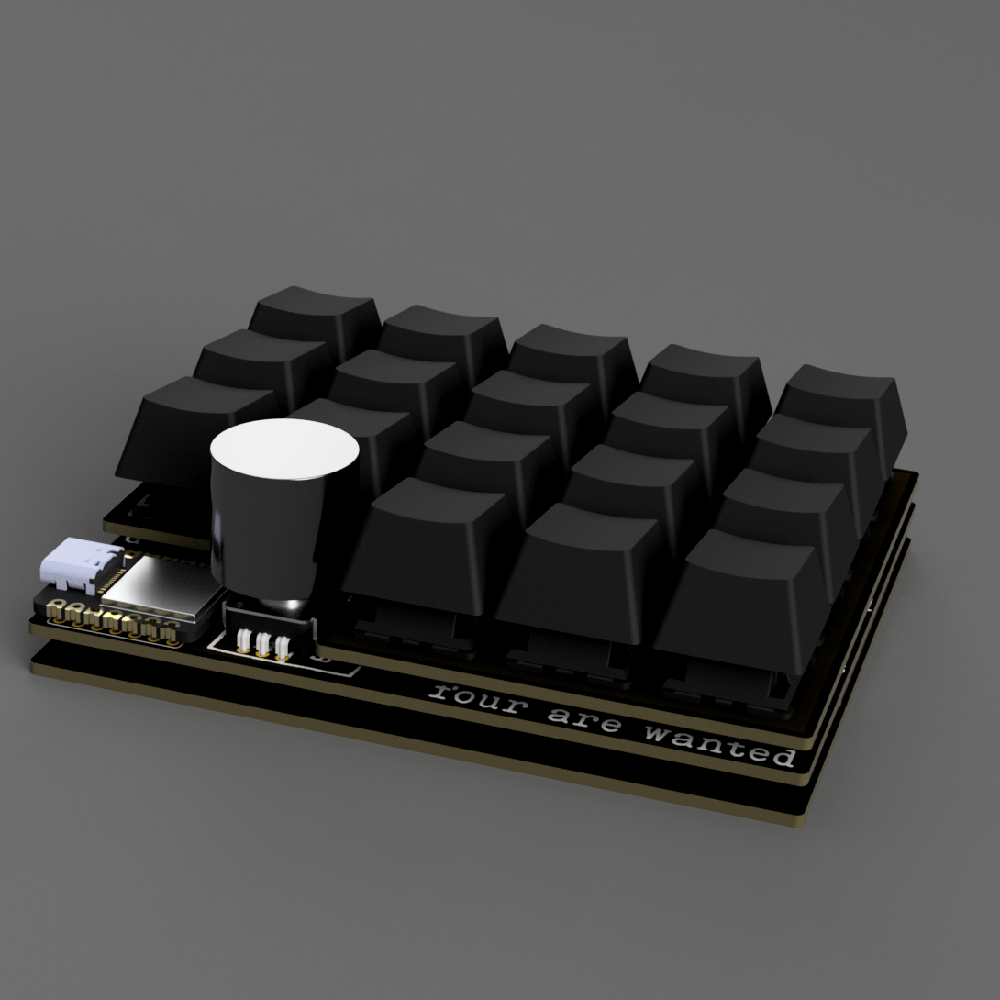

# FAW36

The FAW36 is a split bluetooth keyboard that uses Seeed XIAO BLE boards powered by ZMK.

## Photos and renders





## Info

The PCB is reversible as well as the top and bottom plate.

The PCB support both MX hotswap sockets and standard 5 pin MX solderable footprint.

As for the diodes the PCB supports both THT and SOD123 footprints.

Then encoders are EC11 but as of today only the left one is working.
## Lore

The name comes from the four color theorem which state that.
```
No more than four colors are required to color the regions of any map so that no two adjacent regions have the same color.
```
And written on the PCB is the letter of De Morgan to Hamilton to Sir William Rowan Hamilton in which he explains the findings of his student.
## Links

The config files: https://github.com/Germain-Gadel/zmk-config-faw36